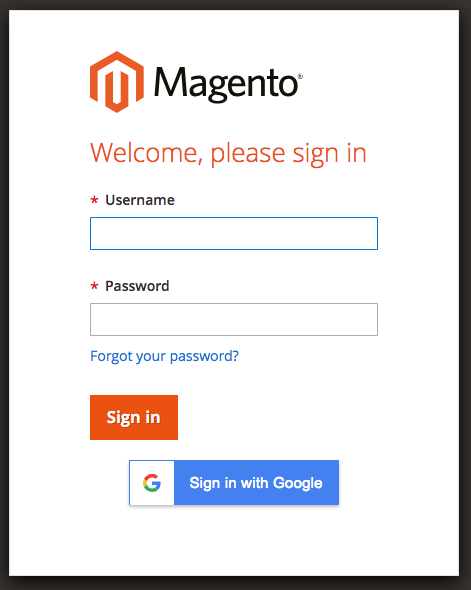

# Google Auth in Magento 2
Modules allow login to Magento 2 administration panel by G Suite Account.



# Install

```bash

```

# Configuration

Go to System -> Configuration -> GOOGLE AUTH  -> General and switch on module by change field Enable to Yes. Then Set Client Id and Secret Id.


Information about how to get Client Id and Secret Id [here](https://developers.google.com/identity/sign-in/web/sign-in#before_you_begin).